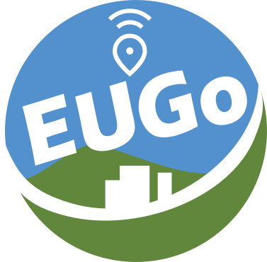

# EUGo: The Eugene Access Map

Finding a decent, safe place to use the bathroom or grab a free bite to eat in downtown Eugene shouldn't be a treasure hunt.

**[Check out the live map here!](https://eugo.site/)**

## What Is This?

It's a community-sourced map for essential services in Eugene, Oregon. Think of it as a cheat sheet for finding:

- Safe public restrooms
- All-gender / gender-neutral bathrooms
- Free food and water
- Public WiFi hotspots

It's built for everyone, but especially for our unhoused people, the LGBTQ+ community, and anyone who's ever had their stomach betray them at an inconvenient time.

## Key Features

- **Community-Sourced:** Real info from real people. See something wrong? Fix it. Know a spot? Add it.
- **Works Offline:** Load the map once, and it's cached on your device.
- **Filterable:** Quickly find what you need, whether it's a private stall, a place with WiFi, or a free meal.
- **Mobile-First & PWA:** It's designed for your phone and you can "install" it to your home screen for quick access.
- **Privacy-Focused:** No tracking, no ads. We don't want your data.

## How You Can Help

#### For Everyone (The Easy Way)

The best way to help is to **use the map and contribute information!**

1.  See the `+` button on the map? Use it to submit a new location.
2.  Find a spot with outdated info? Open its detail view and look for the "Help add information" button to submit corrections.

## The Stack

- **HTML**
- **CSS** (via Tailwind CSS for styling)
- **Vanilla JavaScript**
- **Leaflet.js** for the interactive map.
- **Google Sheets** acts as our free, simple "database".
- **Refuge Restrooms API** for pulling in additional restroom locations.

## A Quick Disclaimer

This is a community project. Locations are submitted by the public and **are not independently verified**. Information might be inaccurate or out-of-date. Please use your best judgment.
